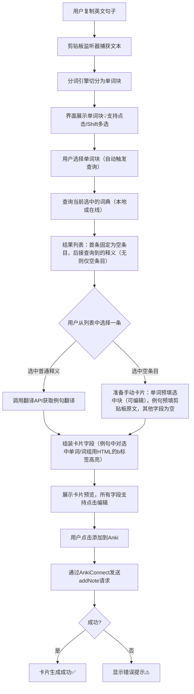

# Anki划词助手
一款将剪贴板中的英文句子切分为单词块，结合本地词典智能生成 Anki 单词卡片的桌面工具。

## 技术栈
- 桌面框架：Flutter (Desktop) + Dart
- 状态管理：Riverpod
- 本地存储：SQLite (sqflite_common_ffi)
- 剪贴板监听：clipboard_watcher
- 词典格式：AnkiHelper 风格的 .txt 纯文本词典（支持多本导入与自动索引）
- 发音服务：有道词典发音 API
- 翻译服务：百度翻译 API / 有道智云 API
- 与 Anki 通信：AnkiConnect (HTTP 本地接口)

## 核心功能
1. 剪贴板智能解析：实时监听系统剪贴板，将复制的英文句子自动切分为单词块，支持手动点选与连续多选组合成词组
2. 本地词典多源查询：内置多本可选本地词典，支持导入 AnkiHelper 格式的 .txt 词典并自动建立索引，快速获取单词的音标与释义
3. 一键制卡与自动翻译：选定释义后，通过 AnkiConnect 直接生成包含单词、音标、发音按钮、释义、例句及例句翻译的 Anki 卡片，例句翻译由在线接口自动完成
4. 灵活配置：可自由启用的本地词典、Anki 牌组与卡片模板，发音源等均可按需调整

## 核心流程图

以下是用 Mermaid 绘制的 Anki 划词助手核心流程图，涵盖了从复制句子到生成卡片的完整路径：

### 流程图节点的细节补充与说明

#### A 用户复制英文句子
- 用户通过系统复制操作将英文句子放入剪贴板。

#### B 剪贴板监听器捕获文本
- 应用监听系统剪贴板变化，自动获取最新复制的英文文本。

#### C 分词引擎切分为单词块
- 对捕获的英文句子进行分词，切分为独立的单词/词组块。
- 支持常见英文分词规则（标点分割、空格分割等）。
- 输出单词块列表供界面展示。

#### D 界面展示单词块（支持点击/Shift多选）
- 以可视化方式（如气泡、按钮等）展示每个单词块。
- 支持**单击**选中单个单词块，**Shift+单击**实现多选（选择连续的单词块形成词组）。
- 高亮显示当前选中的单词块。

#### E 用户选择单词块（自动触发查询）
- 用户通过点击或Shift多选完成单词块选择后，**自动触发后续查询流程**（无需额外点击查询按钮）。
- 需实现**防抖**：连续快速选择时，延迟200-300ms后触发最后一次查询，避免频繁请求。

#### F 查询当前选中的词典（本地或在线）
- 用户可在设置中选择**单个词典**（本地词典或在线词典服务）。
- 查询过程中：
  - 设置**超时时长**（默认5秒，可配置）。
  - 超时后停止查询，显示“查询超时”通知，结果列表仅保留空条目。
- 网络失败或API错误：显示相应通知，列表仅保留空条目。
- 无缓存机制，每次都重新查询。
- 支持**手动重试**：
  - PC端：显示刷新按钮，点击后重新查询当前选中的单词块。

#### G 结果列表：首条固定为空条目，后接查询到的释义（无则仅空条目）
- 查询**立即**显示结果列表结构，不等词典返回：
  - 第一条固定为**空条目**（用于手动添加卡片）。
  - 后续位置先显示**加载图标**（如⚙️转动动画）。
- 词典查询完成后：
  - 有结果：将解析后的释义列表插入到空条目之后，替换加载图标。
  - 无结果：移除加载图标，仅保留空条目，并显示“未查到结果”提示。
- 超时情况：同无结果，仅保留空条目。

#### H 用户从列表中选择一条
- 用户可点击选择**普通释义**（词典返回的具体释义），或选择**空条目**（手动添加入口）。

#### I 调用翻译API获取例句翻译（普通释义分支）
- 仅当用户选择**普通释义**时执行。
- 调用翻译API，根据选中的单词/词组和剪贴板原文（即例句）获取例句翻译。
- 翻译API的具体端点、参数、超时等由实现确定。

#### J 组装卡片字段
- 根据用户所选分支（普通释义或空条目），组装卡片所需的所有字段：
  - 单词（word）
  - 音标（phonetic）
  - 发音URL（audio_url）
  - 释义（definition）
  - 例句（example_sentence）
  - 例句翻译（example_translation）
- 普通释义分支：上述字段主要来自词典查询结果和翻译API。
- 空条目分支：字段内容由下一步（K节点）准备。

#### K 准备手动卡片（空条目分支）
- 仅当用户选择**空条目**时执行。
- 不调用翻译API，字段准备规则如下：
  - 单词：预填用户选中的单词块，默认**非编辑状态**（需点击一次才能编辑）。
  - 音标：空字符串
  - 发音URL：空字符串
  - 释义：空字符串（用户手动填写）
  - 例句：预填用户复制时的**剪贴板原文**（可编辑）
  - 例句翻译：空字符串（用户手动填写）
- 然后进入J节点统一组装卡片。

#### L 展示卡片预览，所有字段支持点击编辑
- 展示组装好的卡片字段预览界面。
- **所有字段**（单词、音标、发音URL、释义、例句、例句翻译）均支持**点击后编辑**。
  - 单词字段默认非编辑状态，单击后变为可编辑输入框。
  - 其他字段单击后直接可编辑。
- 用户可在预览界面修改任意字段内容。

#### M 用户点击添加到Anki
- 预览界面确认后，用户点击“添加到Anki”按钮。
- 触发AnkiConnect接口调用。

#### N 通过AnkiConnect发送addNote请求
- 将当前卡片字段组装为Anki笔记格式（deck、model、fields等）。
- AnkiConnect需处于运行状态，监听端口默认8765。

#### O 成功？
- 判断AnkiConnect返回的状态。

#### P 卡片生成成功
- 显示成功提示（如“卡片已添加到Anki”）。

#### Q 显示错误提示
- 若AnkiConnect返回失败或连接异常，显示错误提示（如“⚠️检查Anki及连接”）。
- 提示应非侵入式（Toast或Snackbar），并建议用户检查Anki是否运行、AnkiConnect插件是否安装。

