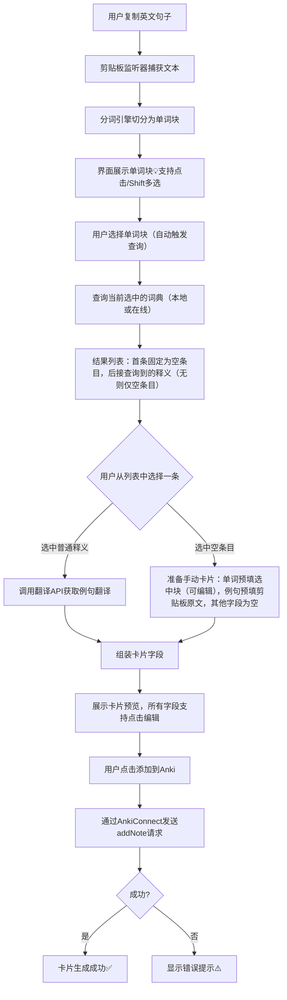

# Anki划词助手
一款将剪贴板中的英文句子切分为单词块，结合本地词典智能生成 Anki 单词卡片的桌面工具。

## 技术栈
- 桌面框架：Flutter (Desktop) + Dart
- 状态管理：Riverpod
- 本地存储：SQLite (sqflite_common_ffi)
- 剪贴板监听：clipboard_watcher
- 词典格式：AnkiHelper 风格的 .txt 纯文本词典（支持多本导入与自动索引）
- 发音服务：有道词典发音 API
- 翻译服务：百度翻译 API / 有道智云 API
- 与 Anki 通信：AnkiConnect (HTTP 本地接口)

## 核心功能
1. 剪贴板智能解析：实时监听系统剪贴板，将复制的英文句子自动切分为单词块，支持手动点选与连续多选组合成词组
2. 本地词典多源查询：内置多本可选本地词典，支持导入 AnkiHelper 格式的 .txt 词典并自动建立索引，快速获取单词的音标与释义
3. 一键制卡与自动翻译：选定释义后，通过 AnkiConnect 直接生成包含单词、音标、发音按钮、释义、例句及例句翻译的 Anki 卡片，例句翻译由在线接口自动完成
4. 灵活配置：可自由启用的本地词典、Anki 牌组与卡片模板，发音源等均可按需调整

## 核心流程图

以下是用 Mermaid 绘制的 Anki 划词助手核心流程图，涵盖了从复制句子到生成卡片的完整路径：

