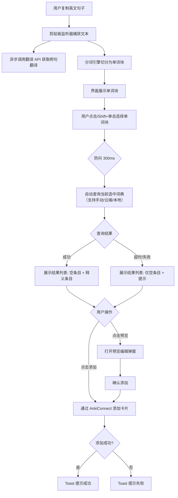

# Anki划词助手
一款将剪贴板中的英文句子切分为单词块，结合本地词典智能生成 Anki 单词卡片的桌面工具。

## 技术栈
- 桌面框架：Flutter (Desktop) + Dart
- 状态管理：Riverpod
- 本地存储：SQLite (sqflite_common_ffi)
- 剪贴板监听：clipboard_watcher
- 词典格式：AnkiHelper 风格的 .txt 纯文本词典（支持多本导入与自动索引）
- 发音服务：有道词典发音 API
- 翻译服务：百度翻译 API / 有道智云 API
- 与 Anki 通信：AnkiConnect (HTTP 本地接口)

## 核心功能
1. 剪贴板智能解析：实时监听系统剪贴板，将复制的英文句子自动切分为单词块，支持手动点选与连续多选组合成词组
2. 本地词典多源查询：内置多本可选本地词典，支持导入 AnkiHelper 格式的 .txt 词典并自动建立索引，快速获取单词的音标与释义
3. 一键制卡与自动翻译：选定释义后，通过 AnkiConnect 直接生成包含单词、音标、发音按钮、释义、例句及例句翻译的 Anki 卡片，例句翻译由在线接口自动完成
4. 灵活配置：可自由启用的本地词典、Anki 牌组与卡片模板，发音源等均可按需调整

## 核心流程图


```mermaid
graph TD
    A[用户复制英文句子] --> B[剪贴板监听器捕获文本];
    B --> C[异步调用翻译 API 获取例句翻译];
    B --> D[分词引擎切分为单词块];
    D --> E[界面展示单词块];
    E --> F[用户点击/Shift+单击选择单词块];
    F --> G{防抖 300ms};
    G --> H[自动查询当前选中词典<br/>（支持手动/云端/本地）];
    H --> I{查询结果};
    I -->|成功| J[展示结果列表: 空条目 + 释义条目];
    I -->|超时/失败| K[展示结果列表: 仅空条目 + 提示];
    J --> L{用户操作};
    K --> L;
    L -->|点击添加| M[通过 AnkiConnect 添加卡片];
    L -->|点击预览| N[打开预览编辑弹窗];
    N --> O[确认添加];
    O --> M;
    M --> P{添加成功?};
    P -->|是| Q[Toast 提示成功];
    P -->|否| R[Toast 提示失败];
```

> **注解（节点 H）**：该节点的查询实现按优先级分为：① 手动添加（默认兜底，始终可用）；② 云端词典（e.g. 有道 API）；③ 本地词典。无论哪种实现，结果列表第一条始终为手动编辑的空条目。

## 页面布局

```
┌──────────────────────────────────────────────────────────────────────────────┐
│ Anki划词助手 - v0.1                                    [设置] [关于] [手动输入] │
├──────────────────────────────────────────────────────────────────────────────┤
│ 剪贴板原文：                                                                   │
│ "This is an example sentence that you copied."                                │
│ 原文翻译：这是一条你复制的例句。                                   [刷新翻译]  │
├──────────────────────────────────────────────────────────────────────────────┤
│ 单词块（单击选中 / Shift+单击多选）：                                          │
│ ┌─────┐ ┌───┐ ┌──┐ ┌─────────┐ ┌────────┐ ┌──────┐                          │
│ │This │ │is │ │an│ │example  │ │sentence│ │that  │                          │
│ └─────┘ └───┘ └──┘ └─────────┘ └────────┘ └──────┘                          │
│ ┌──────┐ ┌──────┐ ┌───────┐ ┌──────┐                                         │
│ │you   │ │copied│ │.      │ │      │                                         │
│ └──────┘ └──────┘ └───────┘ └──────┘                                         │
│ 当前选中词组： "example sentence"                                      [重试] │
├──────────────────────────────────────────────────────────────────────────────┤
│ 结果列表  当前词典：📖 牛津高阶 (本地)                                         │
│ ┌─────────────────────────────────────────────────────────────────────────┐  │
│ │▶ [空条目] 手动编辑卡片                               [添加卡片] [预览编辑] │  │
│ ├─────────────────────────────────────────────────────────────────────────┤  │
│ │1. example /ɪɡˈzæmp(ə)l/  n. 例子；实例                   [添加] [预览]  │  │
│ │2. sentence /ˈsentəns/      n. 句子；判决                   [添加] [预览]  │  │
│ └─────────────────────────────────────────────────────────────────────────┘  │
│ 提示：双击条目可快速添加 （若无查询结果，仅显示空条目）                         │
├──────────────────────────────────────────────────────────────────────────────┤
│ 状态：✅ 就绪  |  AnkiConnect: 已连接  |  词典查询: 完成 (2条释义)            │
└──────────────────────────────────────────────────────────────────────────────┘
```

> UI 设计原型位于 `docs/anki-word-helper.html`，可直接在浏览器中打开预览。