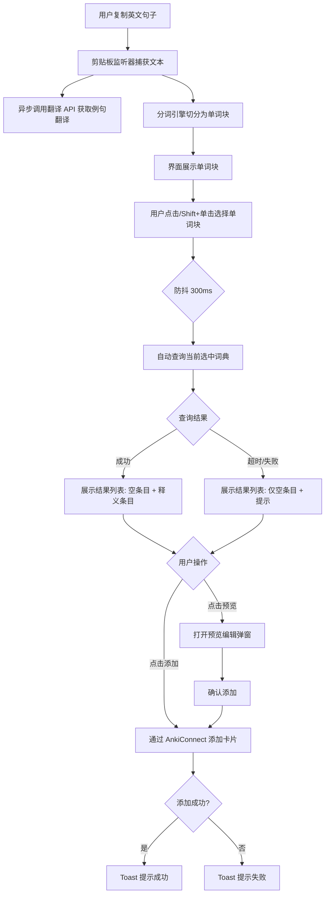

# Anki划词助手 产品需求文档 (PRD) – V1.0

## 1. 产品定位（一句话）

Anki划词助手是一款将剪贴板中的英文句子智能切分为单词块，结合本地词典查询快速生成 Anki 单词卡片的桌面效率工具。

## 2. 用户故事（核心场景）

**场景1：阅读英文文章时快速积累生词**
- 在浏览器或 PDF 阅读器中看到一段英文，复制句子
- 应用自动切分单词，选中生词后查询词典
- 一键添加到 Anki，无需手动编辑卡片

**场景2：批量处理多词查询**
- 句子中有多个不认识的单词
- 通过 Shift+单击连续选中多个单词形成词组
- 每个单词分别查询并独立添加卡片
- 例句字段自动填入原文并高亮选中的单词

**场景3：离线环境下的制卡**
- 在无网络的环境下阅读英文资料
- 依赖本地导入的 .txt 词典完成单词查询
- 翻译功能暂不可用，但制卡流程不受影响

## 3. 功能清单

> **开发策略**：由于已有高保真 HTML 设计原型，优先实现全部 UI 组件，确保界面"长对样子"；之后再串联后端服务与交互逻辑。

### P0功能（全量功能 — 必须完成）

#### Phase 1 — UI 组件层（按设计稿优先实现）

- **主题系统与基础样式**
    - [ ] 基于 Fluent 2 Design 的完整 CSS 变量体系（背景、前景、描边、状态色）
    - [ ] 亮色/暗色双主题完整实现，支持用户手动切换
    - [ ] 主题设置持久化（本地存储）
    - [ ] 字体系统（Segoe UI 字族、各级字号字重）
    - [ ] 间距系统、圆角系统、阴影系统
    - [ ] 滚动条 Fluent 风格样式
    - [ ] 入场动画（fadeIn 等基础过渡）

- **标题栏（TitleBar）**
    - [ ] 左侧：应用图标 SVG + 标题 "Anki划词助手" + 版本号
    - [ ] 右侧操作按钮组：主题切换（🌙/☀️）、设置（⚙）、关于（ℹ）、手动输入（✏）
    - [ ] 按钮交互状态：hover / active 反馈
    - [ ] 分隔线底部边框

- **剪贴板区域（ClipboardSection）**
    - [ ] 区域标题 "剪贴板原文"（大写标签）
    - [ ] 原文展示框：白色背景、圆角、内边距
    - [ ] 原文翻译行：标签 + 翻译文本展示框
    - [ ] "刷新翻译"按钮（带旋转图标）

- **单词块区域（WordsSection）**
    - [ ] 区域标题 "单词块" + 操作提示文字
    - [ ] 单词块网格布局（flex-wrap）
    - [ ] 单词块样式：圆角边框、hover 高亮、选中态品牌色高亮
    - [ ] 标点符号块特殊样式（灰色）
    - [ ] 单击选中 / Shift+单击连续多选交互
    - [ ] 当前选中词组展示区域：标签 + 词组文本（品牌色高亮）

- **结果列表（ResultsList）**
    - [ ] 区域标题 "结果列表" + 当前词典信息标签（图标 + 词典名）
    - [ ] 首条固定为空条目（序号▶、标签"[空条目] 手动编辑卡片"、添加卡片按钮、预览编辑按钮）
    - [ ] 释义条目模板：序号、单词、音标、词性标签、释义
    - [ ] 每个条目的操作按钮组："添加"按钮（outline 样式） + "预览"按钮（subtle 样式）
    - [ ] 条目 hover 高亮效果
    - [ ] 空条目虚线边框样式
    - [ ] 加载中状态：条目位置展示加载动画
    - [ ] 双击条目快速添加交互
    - [ ] 底部提示文字

- **预览弹窗（PreviewModal）**
    - [ ] 半透明遮罩层
    - [ ] 居中弹窗卡片：标题 "卡片预览" + 关闭按钮
    - [ ] 字段展示区域：正面（单词）、音标（等宽字体）、背面（释义）、例句
    - [ ] 底部操作栏："取消"按钮（outline） + "添加到 Anki"按钮（primary）
    - [ ] 点击遮罩层关闭 / Escape 键关闭

- **状态栏（StatusBar）**
    - [ ] 三组状态指示：应用状态 + AnkiConnect 连接 + 词典查询
    - [ ] 每个状态：圆点指示器 + 标签文字
    - [ ] 状态圆点颜色：成功(绿) / 警告(黄) / 错误(红)
    - [ ] 分隔线
    - [ ] 顶部边框线

- **Toast 通知系统**
    - [ ] 底部居中固定容器
    - [ ] 通知卡片：图标 + 文本
    - [ ] 入场/离场动画（滑入+淡入）
    - [ ] 自动消失（2 秒）

- **设置面板 / 关于弹窗 / 手动输入弹窗**
    - [ ] 设置面板界面（复用 Modal 组件）：词典管理、牌组选择、翻译 API 配置
    - [ ] 关于弹窗：显示应用信息
    - [ ] 手动输入弹窗：文本框 + 确认按钮

#### Phase 2 — 后端服务层（串联 UI 与数据）

- **剪贴板监听与原文展示**
    - [ ] 启动后自动监听系统剪贴板变化（clipboard_watcher）
    - [ ] 捕获到新的英文文本后自动更新 UI 原文展示区域
    - [ ] 防抖处理（延迟 200-300ms 避免频繁触发）

- **分词引擎**
    - [ ] 对捕获的英文句子进行智能分词，拆分为独立单词/标点块
    - [ ] 支持常见英文分词规则（空格、标点分割等）
    - [ ] 输出单词块列表供单词块区域展示

- **单词块交互逻辑**
    - [ ] 单词块单击选中 / Shift+单击多选状态管理
    - [ ] 选中状态与 UI 高亮同步
    - [ ] 当前选中词组文本实时更新
    - [ ] 选中变化后防抖 300ms 自动触发词典查询

- **词典查询引擎**
    - [ ] 加载 AnkiHelper 格式的 .txt 纯文本词典
    - [ ] 多本词典导入并自动建立索引
    - [ ] 用户在设置中选择当前启用的词典
    - [ ] 查询超时机制（默认 5 秒，可配置）
    - [ ] 查询失败或超时时结果列表仅保留空条目，显示相应提示
    - [ ] 手动重试刷新按钮功能

- **AnkiConnect 卡片添加**
    - [ ] 通过 AnkiConnect HTTP 接口发送 addNote 请求
    - [ ] 添加成功/失败后 Toast 反馈
    - [ ] 预览弹窗确认后触发添加
    - [ ] 例句字段中选中词汇用 `<b>` 标签高亮

- **翻译服务**
    - [ ] 剪贴板原文自动调用翻译 API 获取中文翻译
    - [ ] 支持百度翻译 API / 有道智云 API（用户配置）
    - [ ] 翻译结果更新到 UI 剪贴板翻译区域
    - [ ] 刷新翻译按钮功能
    - [ ] 异步获取，不阻塞分词和查询

- **发音服务**
    - [ ] 卡片生成时自动填充发音 URL（有道词典发音 API）

### P1功能（体验增强）

- [ ] **空条目编辑**：空条目支持手动编辑正面和背面内容后再添加卡片
- [ ] **手动输入模式**：用户可不依赖剪贴板，在手动输入弹窗中输入英文文本进行查询制卡

### P2功能（未来考虑）

- [ ] **智能词组识别**：识别常见固定搭配和短语（如 "look forward to"），作为一个整体词组查询
- [ ] **历史记录**：保存已添加的卡片历史，避免重复添加
- [ ] **快捷键支持**：全局快捷键快速唤出/隐藏应用
- [ ] **多语言支持**：扩展剪贴板监听和翻译支持更多语言
- [ ] **在线词典**：接入在线词典 API（如有道、牛津在线）作为本地词典的补充
- [ ] **自动主题切换**：跟随系统主题自动切换亮色/暗色

## 4. 用户界面布局

```
┌──────────────────────────────────────────────────────────────────────────────┐
│ Anki划词助手 - v0.1                   [🌙主题] [⚙设置] [ℹ关于] [✏手动输入]   │
├──────────────────────────────────────────────────────────────────────────────┤
│ 剪贴板原文                                                                    │
│ ┌──────────────────────────────────────────────────────────────────────────┐ │
│ │ "This is an example sentence that you copied."                           │ │
│ └──────────────────────────────────────────────────────────────────────────┘ │
│ 原文翻译 ┌────────────────────────────────────────────────┐ [🔄刷新翻译]     │
│          │ 这是一条你复制的例句。                          │                  │
│          └────────────────────────────────────────────────┘                  │
├──────────────────────────────────────────────────────────────────────────────┤
│ 单词块（单击选中 / Shift+单击多选）                                          │
│ ┌─────┐ ┌───┐ ┌──┐ ┌─────────┐ ┌────────┐ ┌──────┐                        │
│ │This │ │is │ │an│ │example  │ │sentence│ │that  │                        │
│ └─────┘ └───┘ └──┘ └─────────┘ └────────┘ └──────┘                        │
│ ┌──────┐ ┌──────┐ ┌──────┐                                                  │
│ │you   │ │copied│ │.     │                                                  │
│ └──────┘ └──────┘ └──────┘                                                  │
│ 当前选中词组： "example sentence"                                            │
├──────────────────────────────────────────────────────────────────────────────┤
│ 结果列表                  当前词典：📖 牛津高阶 (本地)                        │
│ ┌─────────────────────────────────────────────────────────────────────────┐  │
│ │▶ [空条目] 手动编辑卡片                               [添加卡片] [预览编辑] │  │
│ ├─────────────────────────────────────────────────────────────────────────┤  │
│ │1. example  /ɪɡˈzæmp(ə)l/  n. 例子；实例                 [添加] [预览]  │  │
│ │2. sentence /ˈsentəns/      n. 句子；判决                 [添加] [预览]  │  │
│ └─────────────────────────────────────────────────────────────────────────┘  │
│ 提示：双击条目可快速添加（若无查询结果，仅显示空条目）                         │
├──────────────────────────────────────────────────────────────────────────────┤
│ ● 就绪  |  ● AnkiConnect: 已连接  |  ● 词典查询: 完成 (2条释义)             │
└──────────────────────────────────────────────────────────────────────────────┘
```

## 5. 核心流程图



## 6. 卡片字段定义

| Anki 字段名 | 内容 | 数据来源 |
|---|---|---|
| `单词` | 选中的单词/词组文本 | 分词结果 |
| `音标` | 单词的音标字符串 | 词典查询 |
| `发音` | 发音音频 URL | 有道发音 API |
| `例句` | 从剪贴板原文提取，选中词汇用 `<b>` 标签高亮 | 剪贴板原文 + 分词索引 |
| `释义` | 中文释义 | 词典查询 |
| `例句翻译` | 例句的中文翻译 | 翻译 API |
| `url` | 预留字段（隐藏） | — |
