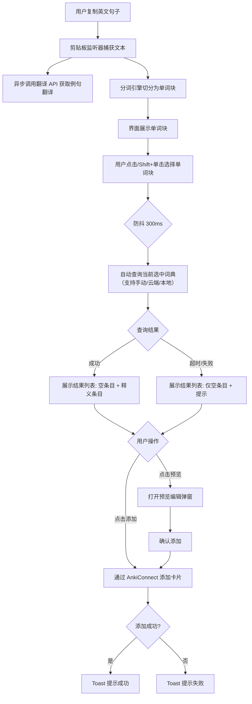

# Anki划词助手 产品需求文档 (PRD) – V1.0
> **设计原型**：本产品的 UI 高保真原型位于同级文件
  `anki-word-helper.html`，基于 Fluent 2 Design
  系统，支持亮色/暗色双主题预览。可通过 Open Design MCP 拉取源码。
## 1. 产品定位（一句话）

Anki划词助手是一款将剪贴板中的英文句子智能切分为单词块，结合本地词典查询快速生成 Anki 单词卡片的桌面效率工具。

## 2. 用户故事（核心场景）

**场景1：阅读英文文章时快速积累生词**
- 在浏览器或 PDF 阅读器中看到一段英文，复制句子
- 应用自动切分单词，选中生词后查询词典
- 一键添加到 Anki，无需手动编辑卡片

**场景2：批量处理多词查询**
- 句子中有多个不认识的单词
- 通过 Shift+单击连续选中多个单词形成词组
- 每个单词分别查询并独立添加卡片
- 例句字段自动填入原文并高亮选中的单词

**场景3：离线环境下的制卡**
- 在无网络的环境下阅读英文资料
- 依赖本地导入的 .txt 词典完成单词查询
- 翻译功能暂不可用，但制卡流程不受影响

## 3. 功能清单

> **开发策略**：由于已有高保真 HTML 设计原型，优先实现全部 UI 组件，确保界面"长对样子"；之后再串联后端服务与交互逻辑。

### P0功能（全量功能 — 必须完成）

#### Phase 1 — UI 组件层（按设计稿优先实现） ✅

- [x] **主题系统与基础样式**
    - [x] 基于 Fluent 2 Design 的完整 CSS 变量体系（背景、前景、描边、状态色）
    - [x] 亮色/暗色双主题完整实现，支持用户手动切换
    - [x] 主题设置持久化（本地存储）
    - [x] 字体系统（Segoe UI 字族、各级字号字重）
    - [x] 间距系统、圆角系统、阴影系统
    - [x] 滚动条 Fluent 风格样式
    - [x] 入场动画（fadeIn 等基础过渡）

- [x] **应用图标**
    - [x] 设计并实现跨平台应用图标
    - [x] 支持 macOS、Windows、iOS、Web、Android 各平台图标格式
    - [x] 使用 flutter_launcher_icons 自动生成各平台图标

- [x] **标题栏（TitleBar）**
    - [x] 左侧：应用图标 SVG + 标题 "Anki划词助手" + 版本号
    - [x] 右侧操作按钮组：主题切换（🌙/☀️）、设置（⚙）、关于（ℹ）、手动输入（✏）
    - [x] 按钮交互状态：hover / active 反馈
    - [x] 分隔线底部边框

- [x] **剪贴板区域（ClipboardSection）**
    - [x] 区域标题 "剪贴板原文"（大写标签）
    - [x] 原文展示框：白色背景、圆角、内边距
    - [x] 原文翻译行：标签 + 翻译文本展示框
    - [x] "刷新翻译"按钮（带旋转图标）

- [x] **单词块区域（WordsSection）**
    - [x] 区域标题 "单词块" + 操作提示文字
    - [x] 单词块网格布局（flex-wrap）
    - [x] 单词块样式：圆角边框、hover 高亮、选中态品牌色高亮
    - [x] 标点符号块特殊样式（灰色）
    - [x] 单击选中 / Shift+单击连续多选交互
    - [x] 当前选中词组展示区域：标签 + 词组文本（品牌色高亮）

- [x] **结果列表（ResultsList）**
    - [x] 区域标题 "结果列表" + 当前词典信息标签（图标 + 词典名）
    - [x] 选中词实时显示，word 为空时"添加"按钮 disabled
    - [x] 编辑模式下所有字段为 TextField（单词/音标/释义/例句/例句翻译），可根据模板字段动态调整
    - [x] 释义条目模板：序号、单词、音标、词性标签、释义
    - [x] 每个条目的操作按钮组："添加"按钮（outline 样式） + "预览"按钮（subtle 样式）
    - [x] 条目 hover 高亮效果
    - [x] 加载中状态：条目位置展示加载动画
    - [x] 双击条目快速添加交互
    - [x] 底部提示文字

- [x] **预览弹窗（PreviewModal）**
    - [x] 半透明遮罩层
    - [x] 居中弹窗卡片：标题 "卡片预览" + 关闭按钮
    - [x] 字段展示区域：根据选中模板的字段动态渲染输入框，每个模板字段对应一个可编辑输入框，输入框 label 为模板字段名
    - [x] 输入框初始值根据字段映射从 UI 数据源预填充
    - [x] 底部操作栏："取消"按钮（outline） + "添加到 Anki"按钮（primary）
    - [x] 点击遮罩层关闭 / Escape 键关闭

- [x] **状态栏（StatusBar）**
    - [x] 三组状态指示：应用状态 + AnkiConnect 连接 + 词典查询
    - [x] 每个状态：圆点指示器 + 标签文字
    - [x] 状态圆点颜色：成功(绿) / 警告(黄) / 错误(红)
    - [x] 分隔线
    - [x] 顶部边框线

- [x] **Toast 通知系统**
    - [x] 底部居中固定容器
    - [x] 通知卡片：图标 + 文本
    - [x] 入场/离场动画（滑入+淡入）
    - [x] 自动消失（2 秒）

- [x] **设置面板 / 关于弹窗 / 手动输入弹窗**
    - [x] 设置面板界面（复用 Modal 组件）：词典管理、牌组选择、翻译 API 配置
    - [x] 关于弹窗：显示应用信息
    - [x] 手动输入弹窗：文本框 + 确认按钮

#### Phase 2 — 后端服务层（串联 UI 与数据）

- **AnkiConnect 基础连接**
    - [x] 引入 `http` 网络请求依赖
    - [x] 创建 AnkiConnect 服务类，封装 JSON-RPC 调用（默认连接 `localhost:8765`）
    - [x] 实现连接检测（`version` action），状态栏显示真实连接状态
    - [x] 通过 AnkiConnect HTTP 接口发送 `addNote` 请求添加样例卡片到测试牌组 `ankihelper-pc-test`
    - [x] 添加成功/失败后 Toast 反馈

- **牌组选择器**
    - [x] 创建牌组 Provider：从 AnkiConnect 获取牌组列表、管理选中状态
    - [x] 创建牌组选择器组件：药丸形容器 + 可搜索输入框 + 下拉列表，匹配 Open Design 设计稿
    - [x] 集成到结果列表标题行，替换静态词典标签区域
    - [x] 添加卡片时使用用户选中的牌组（替换硬编码的 `ankihelper-pc-test`）

- **剪贴板监听与原文编辑**
    - [x] 启动后自动监听系统剪贴板变化（clipboard_watcher）
    - [x] 捕获到新的英文文本后自动更新 UI 原文展示区域
    - [x] 防抖处理（延迟 200-300ms 避免频繁触发）
    - [x] 原文展示区域支持手动编辑：用户可直接点击输入框修改、粘贴或输入英文文本
    - [x] 手动编辑后当光标离开输入框（on blur）自动触发分词与查询流程
    - [x] 手动编辑期间暂停剪贴板监听，编辑完成后恢复
    - [x] 原文锁定功能：标题旁的 🔓/🔒 按钮，锁定后原文不可编辑且不响应剪贴板变化，防止翻译复制时覆盖原文

- **翻译服务**
    - [x] 剪贴板原文内容变化时，清空翻译字段并显示占位符"（等待翻译...）"
    - [x] 点击刷新翻译按钮时调用翻译 API 获取中文翻译
    - [x] 支持百度翻译 API / 有道智云 API（用户在设置中配置）
    - [x] 翻译结果更新到 UI 原文翻译区域
    - [x] 翻译字段支持用户手动编辑
    - [x] 异步获取，不阻塞分词和查询

- **分词引擎**
    - [x] 对捕获的英文句子进行智能分词，拆分为独立单词/标点块
    - [x] 支持常见英文分词规则（空格、标点分割等）
    - [x] 输出单词块列表供单词块区域展示
    - [x] 原文变化时清空单词块区域，与翻译字段行为一致

- **单词块交互逻辑**
    - [x] 单词块单击选中 / Shift+单击多选状态管理
    - [x] 选中状态与 UI 高亮同步
    - [x] 当前选中词组文本实时更新

- **词典查询引擎 — Phase 1：手动添加（默认兜底，始终可用）** ✅
    - [x] 选中词→结果列表实时更新（wordSelectionProvider.currentEntry）
    - [x] 预览弹窗动态字段，编辑后添加到 Anki
    - [x] 无需任何词典即可使用此功能

- **AnkiConnect 完整功能**
    - [x] **卡片模板管理（统一文件解析）**：
        - [x] 模板由 `.html` 文件定义（4 段 `@@@` 分隔：正面/背面/CSS/字段名）
        - [x] 设置面板增加模板选择入口（下拉列表）+ "导入模板"按钮
        - [x] 用户可手动导入 HTML 模板文件，导入后作为默认选项
        - [x] 选定模板后展示字段映射配置区（可编辑：Select 选择器）
        - [x] 已导入的模板可删除（内置模板不可删除）
        - [x] 空条目支持手动编辑所有字段后添加到 Anki
        - [x] 字段映射配置随模板持久化（下次启动保持）
        - [x] 导入默认字段映射：第一个模板字段→单词，其余→空
    - [x] 预览弹窗确认后触发添加
    - [x] 例句字段中选中词汇用 `<b>` 标签高亮
    - [x] 启动时自动加载内置模板（`assets/template01/.html + .json`），注册延迟到添加卡片时
    - [x] 内置模板与用户导入的模板共用同一套解析和注册逻辑

- **发音服务**
    - [ ] 卡片生成时自动填充发音 URL（有道词典发音 API）

### P1功能（体验增强）

- [ ] **手动输入模式**：用户可不依赖剪贴板，在手动输入弹窗中输入英文文本进行查询制卡
- [ ] **词典查询引擎 — Phase 2：云端词典查询**
    - [ ] 选中变化后防抖 300ms 自动触发词典查询
    - [ ] 接入有道智云 API 进行单词查询
    - [ ] 查询超时机制（默认 5 秒，可配置）
    - [ ] 查询失败或超时时结果列表仅保留空条目，显示相应提示
    - [ ] API 密钥配置（在设置面板中）
    - [ ] 手动重试刷新按钮功能

### P2功能（未来考虑）

- [ ] **智能词组识别**：识别常见固定搭配和短语（如 "look forward to"），作为一个整体词组查询
- [ ] **历史记录**：保存已添加的卡片历史，避免重复添加
- [ ] **快捷键支持**：全局快捷键快速唤出/隐藏应用
- [ ] **多语言支持**：扩展剪贴板监听和翻译支持更多语言
- [ ] **在线词典**：接入在线词典 API（如有道、牛津在线）作为本地词典的补充
- [ ] **自动主题切换**：跟随系统主题自动切换亮色/暗色
- [ ] **词典查询引擎 — Phase 3：本地词典查询**
    - [ ] 选中变化后防抖 300ms 自动触发词典查询
    - [ ] 加载 AnkiHelper 格式的 .txt 纯文本词典
    - [ ] 多本词典导入并自动建立索引
    - [ ] 用户在设置中选择当前启用的词典
    - [ ] 本地查询优先级低于云端词典（作为备选方案）

## 4. 用户界面布局

```
┌──────────────────────────────────────────────────────────────────────────────┐
│ Anki划词助手 - v0.1                   [🌙主题] [⚙设置] [ℹ关于] [✏手动输入]   │
├──────────────────────────────────────────────────────────────────────────────┤
│ 剪贴板原文                                                                    │
│ ┌──────────────────────────────────────────────────────────────────────────┐ │
│ │ "This is an example sentence that you copied."                           │ │
│ └──────────────────────────────────────────────────────────────────────────┘ │
│ 原文翻译 ┌────────────────────────────────────────────────┐ [🔄刷新翻译]     │
│          │ 这是一条你复制的例句。                          │                  │
│          └────────────────────────────────────────────────┘                  │
├──────────────────────────────────────────────────────────────────────────────┤
│ 单词块（单击选中 / Shift+单击多选）                                          │
│ ┌─────┐ ┌───┐ ┌──┐ ┌─────────┐ ┌────────┐ ┌──────┐                        │
│ │This │ │is │ │an│ │example  │ │sentence│ │that  │                        │
│ └─────┘ └───┘ └──┘ └─────────┘ └────────┘ └──────┘                        │
│ ┌──────┐ ┌──────┐ ┌──────┐                                                  │
│ │you   │ │copied│ │.     │                                                  │
│ └──────┘ └──────┘ └──────┘                                                  │
│ 当前选中词组： "example sentence"                                            │
├──────────────────────────────────────────────────────────────────────────────┤
│ 结果列表                  当前词典：📖 牛津高阶 (本地)                        │
│ ┌─────────────────────────────────────────────────────────────────────────┐  │
│ │▶ [空条目] 手动编辑卡片                               [添加卡片] [预览编辑] │  │
│ ├─────────────────────────────────────────────────────────────────────────┤  │
│ │1. example  /ɪɡˈzæmp(ə)l/  n. 例子；实例                 [添加] [预览]  │  │
│ │2. sentence /ˈsentəns/      n. 句子；判决                 [添加] [预览]  │  │
│ └─────────────────────────────────────────────────────────────────────────┘  │
│ 提示：双击条目可快速添加（若无查询结果，仅显示空条目）                         │
├──────────────────────────────────────────────────────────────────────────────┤
│ ● 就绪  |  ● AnkiConnect: 已连接  |  ● 词典查询: 完成 (2条释义)             │
└──────────────────────────────────────────────────────────────────────────────┘
```

## 5. 核心流程图


```mermaid
graph TD
    A[用户复制英文句子] --> B[剪贴板监听器捕获文本];
    B --> C[异步调用翻译 API 获取例句翻译];
    B --> D[分词引擎切分为单词块];
    D --> E[界面展示单词块];
    E --> F[用户点击/Shift+单击选择单词块];
    F --> G{防抖 300ms};
    G --> H[自动查询当前选中词典<br/>（支持手动/云端/本地）];
    H --> I{查询结果};
    I -->|成功| J[展示结果列表: 空条目 + 释义条目];
    I -->|超时/失败| K[展示结果列表: 仅空条目 + 提示];
    J --> L{用户操作};
    K --> L;
    L -->|点击添加| M[通过 AnkiConnect 添加卡片];
    L -->|点击预览| N[打开预览编辑弹窗];
    N --> O[确认添加];
    O --> M;
    M --> P{添加成功?};
    P -->|是| Q[Toast 提示成功];
    P -->|否| R[Toast 提示失败];
```

> **注解（节点 H）**：该节点的查询实现按优先级分为：① 手动添加（默认兜底，始终可用）；② 云端词典（e.g. 有道 API）；③ 本地词典。无论哪种实现，结果列表第一条始终为手动编辑的空条目。

## 6. 卡片字段定义与字段映射

### 6.1 UI 数据源字段

这些是应用界面上可提供给模板的字段值：

| 数据源 | 对应 UI 区域 | 说明 |
|--------|-------------|------|
| `单词` | 当前选中词组 | 用户选中的单词/词组文本 |
| `例句` | 剪贴板原文 | 剪贴板捕获的英文原文（手动编辑时可修改） |
| `例句翻译` | 原文翻译 | 翻译 API 返回的中文翻译（手动编辑时可修改） |
| `空` | — | 空字符串，用于不需要预填充的模板字段 |

### 6.2 字段映射

用户导入的模板包含自己的字段名列表（例如 `vocabulary_card_model.html` 的模板字段为：单词、音标、发音、例句、释义、例句翻译、url）。通过**字段映射**配置，将 UI 数据源映射到模板字段，用于添加卡片时预填充初始值。

- 导入模板后默认映射：**第一个模板字段 → `单词`，其余模板字段 → `空`**
- 用户可在设置弹窗中修改映射：每个模板字段对应一个 Select 选择器（选项：单词、例句、例句翻译、空）
- 显示格式：`<模板字段名> ← <数据源>`
- 映射配置随模板持久化（存 SharedPreferences），下次选择该模板时继续生效
- 预览编辑时所有字段值可被用户修改，映射只负责初始预填充
